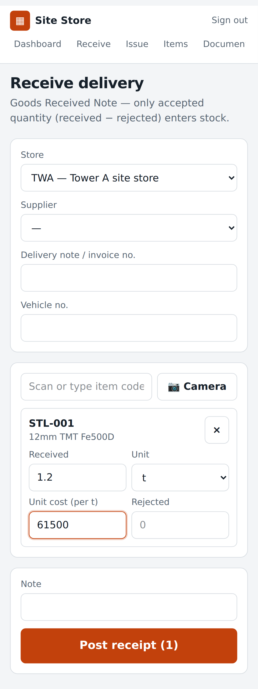
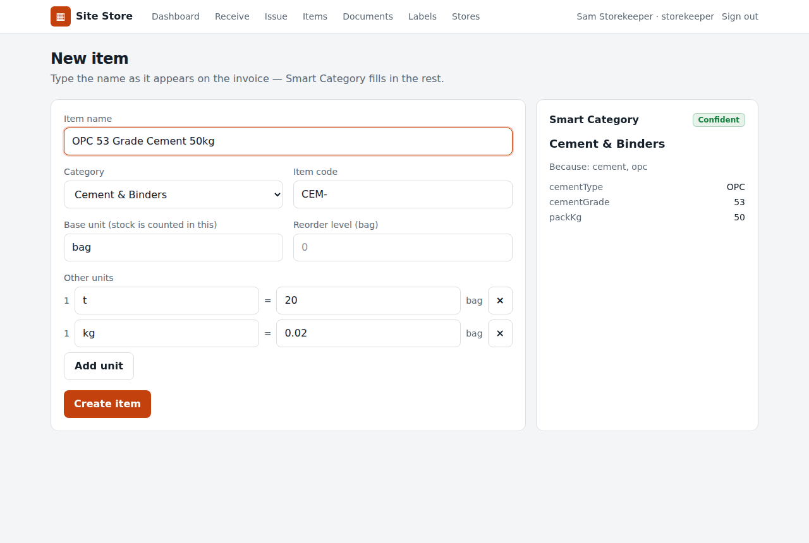

# mybloomhome: Site Store

A store-management app for construction sites. Storekeepers receive deliveries and issue material by scanning QR labels. Stock is kept in an exact, append-only ledger. **Smart Category** fills in the category, units and handling flags from an item's name.

**Status: Phase 1 is built and proven.** Scope is in [`docs/PROMPT.md`](docs/PROMPT.md) §11 and rules in [`docs/phase-1/DESIGN.md`](docs/phase-1/DESIGN.md).

| Phone: receive | Desktop: Smart Category |
|---|---|
|  |  |

## What it does (Phase 1)
- **Items with Smart Category.**
  - Type "OPC 53 Grade Cement 50kg" and it suggests Cement & Binders with base unit bag, adds 1 t = 20 bags and 1 kg = 0.02 bag, and reads the type (OPC), grade (53) and pack (50 kg).
  - Corrections are remembered for that name across the company.
- **QR labels.**
  - Every item and location gets an opaque code.
  - Labels print on an A4 sheet (24 per page) or on 50 × 25 mm thermal labels.
  - Scanning a label with the phone's own camera opens the item.
- **Receive (GRN).**
  - Scan or type items, choose any configured unit, and enter cost and any rejected quantity.
  - Only the accepted quantity enters stock.
- **Issue.**
  - Shows what's available in the store.
  - The server refuses over-issue, even when several phones post at the same moment.
- **Reversal.** Posted documents are read-only. A PM or admin reverses a document once, and the reversal is recorded.
- **Dashboard.** Stock value, receipts and issues today, items below reorder level, and recent documents.
- **Roles.** `admin`, `storekeeper`, `pm` and `engineer` (view only). Access is also limited by store and by company.

## Run it
You need Node 22 and PostgreSQL 16.
```bash
cp .env.example .env              # set DATABASE_URL (and APP_URL in production)
npm ci
createdb store_dev                # or: psql -c 'CREATE DATABASE store_dev'
npm run db:migrate
SEED_PASSWORD='choose-a-password' npm run db:seed
npm run build && npm start        # http://localhost:3000
```
The seed creates:
- `admin@demo.site`, `storekeeper@demo.site`, `pm@demo.site` and `engineer@demo.site`, all with `SEED_PASSWORD`;
- 2 sites, 5 suppliers, and 65 items classified by Smart Category;
- opening stock.

In production, serve over **HTTPS**. Phone cameras only work on secure pages, and the session cookie is `Secure`. Also set `APP_URL`, so printed labels point at the right host.

## Prove it
| Command | What it proves |
|---|---|
| `npm test` | Pure modules (ledger reference model, Smart Category) and QR labels decoding back to their URL |
| `npm run test:db` | Against a real PostgreSQL: every ledger rule; a **randomised differential test** that the database matches the reference model value for value; **concurrency** (25 simultaneous issues, a no-deadlock check, idempotent retries, a double-reversal race); and security |
| `npm run test:e2e` | A real browser: create an item, receive in tonnes, issue in kg, label round trip, correction learning, roles, cross-site refusal, phone layout |
| `npm run prove` | Protocol gates for every module and the app: design doc, isolation, types, **a test for every rule**, and **planted bugs that the tests must catch** |

The process is described in [`docs/PROTOCOL.md`](docs/PROTOCOL.md): **Design → Isolate → Build → Prove**. CI runs all four suites on every push.

## Layout
```
modules/ledger/          reference stock ledger (pure; rules LED-1..12)
modules/smart-category/  classifier + taxonomy (pure; rules SC-1..9)
lib/                     server code: Postgres ledger, auth, items, QR (framework-free)
app/                     Next.js pages and API routes
db/migrations/           SQL schema (append-only trigger, CHECK constraints, unique keys)
tests/  e2e/             Node and PostgreSQL tests; Playwright tests
scripts/                 migrate, seed, prove
```

## Known limits
- **Not yet built:** Phases 2–3 (requests and approvals, returns and transfers, stock counts, reports, offline sync).
- **Camera scanning is checked by hand.** Headless browsers have no camera. Label decoding itself is tested automatically.
- **Currency and number grouping** use Indian formatting (for example 5,76,515.00), and no currency symbol is shown yet.
